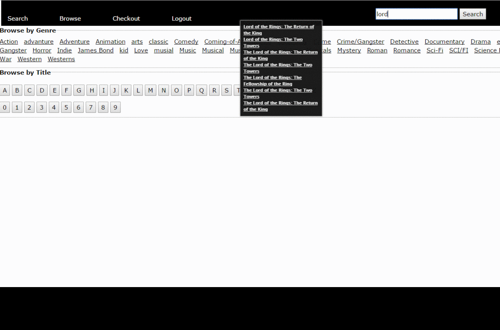

# Fabflix

## Features
* Access to library of 1000's of movies
* User authentication and cart system
* Searching movies by genre, title, year, director, and actors
* Autocomplete search bar

## Implementation
* Java Servlet
* MySQL database housing store of movies and customers
* Hosted website across several AWS instances and utilied Tomcat for load balancing
* Used stored procedure and batch insertions to increase efficiency of larger database operation s
